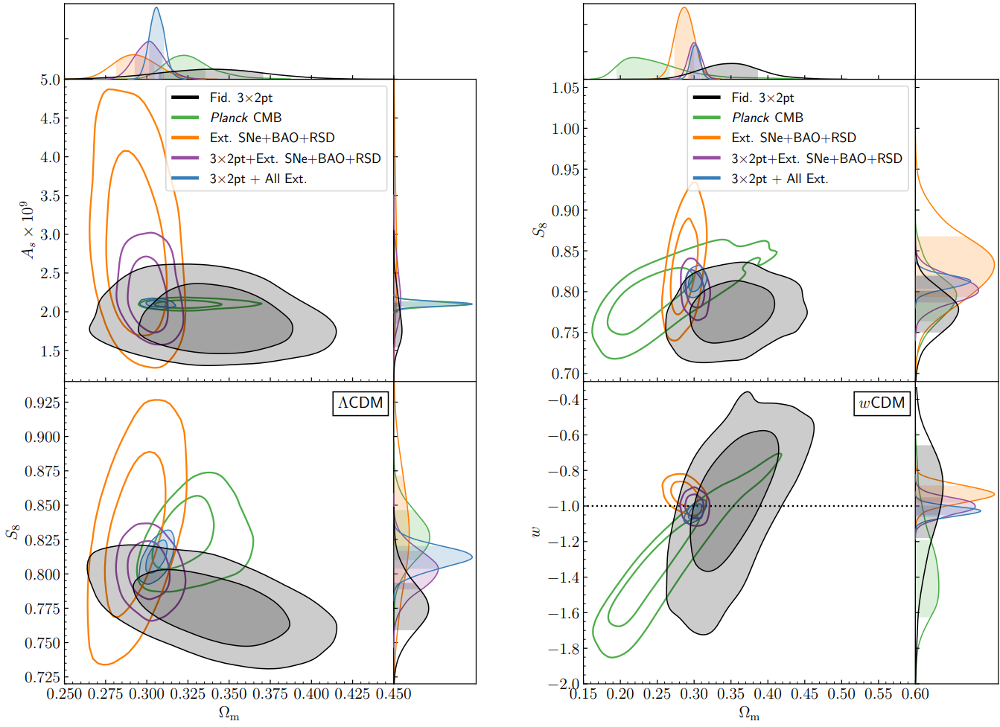

# Intro

In this project, you will use machine learning and MCMC to estimate cosmological parameters using second-order statistics (DES like).

We provide you with the following:
1. $N$ analytical models at different cosmologies (computed with [CosmoSIS](https://cosmosis.readthedocs.io/en/latest/)), for which the cosmology is known.
2. One reference noisefree data vector $d$ at unkown cosmology and one noisy $d$.
3. One analytical covariance matrix and $M$ noisy $d$ drawn from the analytical covariance matrix.

Your tasks is the following:
1. Train+Test emulator using the $N$ analytical models (like [CosmoPower](https://github.com/alessiospuriomancini/cosmopower), or [Capse.jl](https://github.com/CosmologicalEmulators/Capse.jl), or your own)
2. Compute numerical covariance matrix from the $M$ noisy $d$
3. Compute $\chi^2$ with different number of noisy $d$ for the covariance matrix computation, correct by [Hartlap](https://arxiv.org/abs/astro-ph/0608064)/[Percival](https://arxiv.org/abs/2108.10402) factor. Check if you have a $\chi^2$ distribution with correct degrees-of-freedom.
4. Run MCMC chains
    1. Using different covariance matrices (analytical vs. numerical)
    2. Use your own sampler and one [emcee](https://emcee.readthedocs.io/en/stable/) sampler compute the MCMC chains, and compare posteriors and speed
    3. Perform [PCA](https://scikit-learn.org/stable/modules/generated/sklearn.decomposition.PCA.html) data compression, run MCMC and compare to uncompressed posteriors
    4. Bonus: Test different number of $d$ which are used to compute covarinace matrix, and test the correction of Hartlap/Percival factor
    5. Bonus: Use gradient based sampler (like [numpyro](https://github.com/pyro-ppl/numpyro) or [Turing.jl](https://github.com/TuringLang/Turing.jl))
    6. Bonus: Use [CosmoSIS](https://cosmosis.readthedocs.io/en/latest/) to compute MCMC chain

